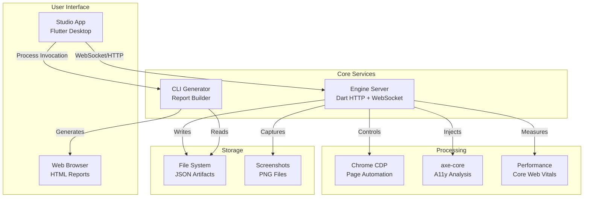

# AuditMySite - Complete Setup & Deployment Guide

## 🚀 Quick Start Options

### Option 1: Docker (Recommended for Production)

```bash
# Clone repository
git clone <your-repo>
cd auditmysite_studio

# Start engine only
docker-compose up auditmysite-engine

# Start full stack with Redis and Nginx
docker-compose --profile production up -d

# Engine available at: http://localhost:3000
# Production access: http://localhost (via Nginx)
```

### Option 2: Development Environment

```bash
# Prerequisites check
flutter --version  # Should be 3.19+
dart --version      # Should be 3.3+
google-chrome --version  # Required for engine

# Install all dependencies
cd auditmysite_studio
./scripts/setup.sh  # Auto-setup script (create if needed)

# Or manual setup:
cd shared && dart pub get && cd ..
cd auditmysite_engine && dart pub get && cd ..
cd auditmysite_cli && dart pub get && cd ..
cd auditmysite_studio && flutter pub get && cd ..

# Download axe-core
wget https://cdnjs.cloudflare.com/ajax/libs/axe-core/4.8.4/axe.min.js \
  -O auditmysite_engine/third_party/axe/axe.min.js

# Start services
cd auditmysite_engine
dart run bin/serve.dart --port=3000 &

cd ../auditmysite_studio
flutter run -d macos
```

## 🏗️ Architecture Overview



## 📦 Component Details

### 🖥️ AuditMySite Engine

**Purpose**: Core audit processing server  
**Tech Stack**: Dart, HTTP server, WebSocket, Puppeteer, Chrome CDP  
**Port**: 3000 (default)  

**Key Features**:
- Sitemap parsing and URL discovery
- Concurrent page processing (configurable workers)
- Real-time WebSocket event streaming
- Performance metrics collection (TTFB, FCP, LCP, DCL)
- axe-core integration for accessibility testing
- Screenshot capture
- Request rate limiting and retry logic
- URL filtering (include/exclude patterns)

**Startup Options**:
```bash
# Development mode
dart run bin/serve.dart --port=3000 --debug

# Production mode  
dart run bin/serve.dart --port=3000 --host=0.0.0.0

# With custom Chrome args
CHROME_ARGS="--no-sandbox,--disable-dev-shm-usage" dart run bin/serve.dart
```

### 🖱️ AuditMySite Studio

**Purpose**: Desktop GUI for audit management  
**Tech Stack**: Flutter, Riverpod state management, SharedPreferences  
**Platforms**: macOS, Windows, Linux  

**Key Features**:
- Auto-discovery of engine instances
- Settings persistence (engine URL, preferences)
- Live audit progress monitoring
- Result loading and analysis with interactive tables
- Export functionality (HTML/CSV/JSON)
- WebSocket connection with auto-reconnect

**Build & Run**:
```bash
# Development
flutter run -d macos

# Release build
flutter build macos --release
flutter build windows --release
flutter build linux --release

# Enable additional platforms if needed
flutter config --enable-windows-desktop
flutter config --enable-linux-desktop
```

### 📊 AuditMySite CLI

**Purpose**: Report generation and data export  
**Tech Stack**: Dart, Mustache templates, file I/O  

**Key Features**:
- Multiple export formats (HTML, CSV, JSON)
- Interactive HTML reports with client-side filtering
- Comprehensive statistics and aggregations
- Performance metric histograms
- Violation categorization by impact level

**Usage Examples**:
```bash
# Basic HTML report
dart run auditmysite_cli:build \
  --in=./artifacts/20231201-143022/pages \
  --out=./reports \
  --title="Website Audit Report"

# All formats
dart run auditmysite_cli:build \
  --in=./artifacts/20231201-143022/pages \
  --out=./reports \
  --format=all

# CSV only for data analysis
dart run auditmysite_cli:build \
  --in=./artifacts/20231201-143022/pages \
  --out=./reports \
  --format=csv
```

## 🐳 Docker Deployment

### Development Setup

```yaml
# docker-compose.yml (development)
version: '3.8'
services:
  auditmysite-engine:
    build:
      context: ./auditmysite_engine
      dockerfile: Dockerfile
    ports:
      - "3000:3000"
    volumes:
      - ./auditmysite_engine:/app  # Hot reload
      - audit_artifacts:/app/artifacts
    environment:
      - LOG_LEVEL=debug
      - DEV_MODE=true
    command: ["dart", "run", "bin/serve.dart", "--port=3000", "--debug"]
```

### Production Setup

```yaml
# docker-compose.yml (production)
version: '3.8'
services:
  auditmysite-engine:
    build:
      context: ./auditmysite_engine
      dockerfile: Dockerfile
    restart: unless-stopped
    environment:
      - LOG_LEVEL=info
      - CHROME_ARGS=--no-sandbox,--disable-setuid-sandbox
    volumes:
      - audit_artifacts:/app/artifacts
    networks:
      - auditmysite-net

  nginx:
    image: nginx:alpine
    ports:
      - "80:80"
      - "443:443"
    volumes:
      - ./nginx.conf:/etc/nginx/nginx.conf:ro
      - audit_artifacts:/usr/share/nginx/html/reports:ro
    depends_on:
      - auditmysite-engine
    networks:
      - auditmysite-net

volumes:
  audit_artifacts:

networks:
  auditmysite-net:
```

### Environment Variables

**Engine Configuration**:
- `LOG_LEVEL`: debug, info, warning, error
- `CHROME_ARGS`: Chrome command line arguments (comma-separated)
- `DEV_MODE`: Enable development features
- `PORT`: Server port (default: 3000)
- `HOST`: Server bind address (default: 0.0.0.0)

**Docker Environment**:
- `DOCKER_BUILDKIT=1`: Enable BuildKit for faster builds
- `COMPOSE_PROFILES`: Enable profile-specific services

## ⚙️ Configuration

### Engine Configuration

**Command Line Options**:
```bash
dart run bin/serve.dart --help

Options:
  --port=<int>           Server port (default: 3000)
  --host=<string>        Host address (default: 0.0.0.0)  
  --debug                Enable debug logging
  --chrome-path=<path>   Custom Chrome executable path
  --no-headless          Run Chrome in headed mode
```

**Runtime Configuration via API**:
```json
POST /audit
{
  "sitemap_url": "https://example.com/sitemap.xml",
  "concurrency": 4,
  "collect_perf": true,
  "screenshots": false,
  "include_patterns": [".*\\/blog\\/.*", ".*\\/products\\/.*"],
  "exclude_patterns": [".*\\.pdf$", ".*\\/admin\\/.*"],
  "max_pages": 100,
  "rate_limit": 10,
  "delay_ms": 100
}
```

### Studio Configuration

Settings are persisted locally using SharedPreferences:

**Engine Connection**:
- Engine URL (default: localhost)
- Engine Port (default: 3000)
- Auto-connect on startup (default: true)

**Report Generation**:
- Default report title (default: "Audit Report")
- Last used output directory
- Preferred export format

**Access Settings**: Navigate to Settings tab in Studio app

### Nginx Configuration

**Basic Reverse Proxy** (`nginx.conf`):
```nginx
events {
    worker_connections 1024;
}

http {
    upstream auditmysite_engine {
        server auditmysite-engine:3000;
    }

    server {
        listen 80;
        server_name localhost;

        # Security headers
        add_header X-Frame-Options "SAMEORIGIN";
        add_header X-Content-Type-Options "nosniff";

        # API proxy
        location /api/ {
            proxy_pass http://auditmysite_engine/;
            proxy_set_header Host $host;
            proxy_set_header X-Real-IP $remote_addr;
            
            # WebSocket support
            proxy_http_version 1.1;
            proxy_set_header Upgrade $http_upgrade;
            proxy_set_header Connection "upgrade";
        }

        # Static reports
        location /reports/ {
            alias /usr/share/nginx/html/reports/;
            autoindex on;
        }
    }
}
```

## 🔍 Monitoring & Logging

### Health Checks

**Engine Health**:
```bash
curl http://localhost:3000/health
# Response: {"status":"ok","uptime":12345}
```

**Docker Health**:
```bash
docker-compose ps
# Should show "healthy" status for engine
```

### Logging

**Development Logging**:
```bash
# Engine debug logs
LOG_LEVEL=debug dart run bin/serve.dart

# Studio debug mode
flutter run -d macos --debug
```

**Production Logging**:
```bash
# Docker logs
docker-compose logs -f auditmysite-engine

# Log rotation
docker-compose logs --tail=100 auditmysite-engine
```

### Performance Monitoring

**Resource Usage**:
```bash
# Container stats
docker stats auditmysite-engine

# Host system monitoring
top -p $(pgrep -f "auditmysite")
```

**Audit Metrics** (via API):
```bash
curl http://localhost:3000/audit/RUN_ID/status
# Returns: progress, timing, resource usage
```

## 🚨 Troubleshooting

### Common Issues

**1. Engine Won't Start**
```bash
# Check port availability
netstat -tulpn | grep :3000

# Check Chrome installation
google-chrome --version

# Docker: Check container logs
docker-compose logs auditmysite-engine
```

**2. Studio Connection Failed**
- Verify engine URL in Settings
- Test manual connection: `curl http://localhost:3000/health`
- Try auto-discovery button in Progress view
- Check firewall/antivirus blocking connections

**3. Chrome/Puppeteer Issues**
```bash
# Install Chrome dependencies (Linux)
sudo apt-get update
sudo apt-get install -y \
  ca-certificates fonts-liberation \
  libappindicator3-1 libasound2 libatk-bridge2.0-0 \
  libdrm2 libgtk-3-0 libnspr4 libnss3 libx11-xcb1 \
  libxtst6 lsb-release wget xdg-utils

# Docker: Ensure --no-sandbox flag
CHROME_ARGS="--no-sandbox,--disable-dev-shm-usage" dart run bin/serve.dart
```

**4. Memory Issues**
```bash
# Reduce concurrency
curl -X POST http://localhost:3000/audit \
  -d '{"sitemap_url": "...", "concurrency": 2}'

# Docker: Increase memory limit
docker-compose.yml:
  services:
    auditmysite-engine:
      mem_limit: 2g
```

**5. Report Generation Fails**
```bash
# Check CLI path detection
dart run auditmysite_cli:build --help

# Verify input directory structure
ls -la artifacts/RUN_ID/pages/

# Check output directory permissions
mkdir -p ./reports && ls -la ./reports/
```

### Debug Mode

**Enable Comprehensive Debugging**:
```bash
# Engine with full debug
LOG_LEVEL=debug dart run bin/serve.dart --debug --no-headless

# Studio with debug output
flutter run -d macos --debug --verbose

# CLI with verbose output
dart run auditmysite_cli:build --in=... --out=... --verbose
```

### Log Analysis

**Engine Logs Pattern**:
```
[INFO] Starting audit for sitemap: https://example.com/sitemap.xml
[DEBUG] Discovered 156 URLs, filtered to 142
[INFO] Starting 4 concurrent workers
[DEBUG] Worker 1: Processing https://example.com/page1
[INFO] Completed audit: 142 pages, 12 errors, 45.2s
```

**WebSocket Connection Logs**:
```
[DEBUG] WebSocket connection established
[INFO] Client connected: 127.0.0.1
[DEBUG] Sending event: page_started
[WARN] WebSocket connection lost, retrying...
```

## 🔒 Security & Production

### Security Checklist

- [ ] **Authentication**: Implement via Nginx basic auth or OAuth
- [ ] **HTTPS**: SSL/TLS certificates configured
- [ ] **Rate Limiting**: API endpoints protected
- [ ] **Input Validation**: Sitemap URLs sanitized
- [ ] **File Permissions**: Artifacts directory secured
- [ ] **Updates**: Dependencies regularly updated

### Production Deployment

**1. SSL/TLS Setup**:
```nginx
server {
    listen 443 ssl http2;
    ssl_certificate /etc/nginx/ssl/cert.pem;
    ssl_certificate_key /etc/nginx/ssl/key.pem;
    # ... rest of config
}
```

**2. Basic Authentication**:
```nginx
location /api/ {
    auth_basic "AuditMySite Access";
    auth_basic_user_file /etc/nginx/.htpasswd;
    proxy_pass http://auditmysite_engine/;
}
```

**3. Backup Strategy**:
```bash
# Automated backup of audit artifacts
#!/bin/bash
DATE=$(date +%Y%m%d_%H%M%S)
tar -czf backup_${DATE}.tar.gz \
  docker-volumes/audit_artifacts
```

### Resource Limits

**Recommended Specifications**:

**Small Deployment (< 50 pages)**:
- CPU: 2 cores
- Memory: 2GB RAM  
- Storage: 10GB SSD
- Concurrency: 2-4

**Medium Deployment (50-200 pages)**:
- CPU: 4 cores
- Memory: 4GB RAM
- Storage: 50GB SSD  
- Concurrency: 4-6

**Large Deployment (200+ pages)**:
- CPU: 8+ cores
- Memory: 8GB+ RAM
- Storage: 100GB+ SSD
- Concurrency: 6-8

## 📚 API Integration Examples

### Node.js Integration

```javascript
const axios = require('axios');
const WebSocket = require('ws');

class AuditMySiteClient {
  constructor(baseUrl = 'http://localhost:3000') {
    this.baseUrl = baseUrl;
  }

  async startAudit(config) {
    const response = await axios.post(`${this.baseUrl}/audit`, config);
    return response.data.run_id;
  }

  watchProgress(runId, onEvent) {
    const ws = new WebSocket(`${this.baseUrl.replace('http', 'ws')}/ws`);
    
    ws.on('message', (data) => {
      const event = JSON.parse(data);
      if (event.run_id === runId) {
        onEvent(event);
      }
    });

    return ws;
  }

  async getResults(runId) {
    const response = await axios.get(`${this.baseUrl}/audit/${runId}/results`);
    return response.data;
  }
}

// Usage
const client = new AuditMySiteClient();

(async () => {
  const runId = await client.startAudit({
    sitemap_url: 'https://example.com/sitemap.xml',
    concurrency: 4,
    collect_perf: true
  });

  client.watchProgress(runId, (event) => {
    console.log(`${event.event}: ${event.url}`);
  });

  // Wait for completion and get results
  // ... polling or WebSocket completion event
})();
```

### Python Integration

```python
import requests
import websocket
import json
import threading

class AuditMySiteClient:
    def __init__(self, base_url='http://localhost:3000'):
        self.base_url = base_url
    
    def start_audit(self, config):
        response = requests.post(f'{self.base_url}/audit', json=config)
        return response.json()['run_id']
    
    def watch_progress(self, run_id, on_event):
        def on_message(ws, message):
            event = json.loads(message)
            if event.get('run_id') == run_id:
                on_event(event)
        
        ws_url = self.base_url.replace('http', 'ws') + '/ws'
        ws = websocket.WebSocketApp(ws_url, on_message=on_message)
        
        wst = threading.Thread(target=ws.run_forever)
        wst.daemon = True
        wst.start()
        
        return ws
    
    def get_results(self, run_id):
        response = requests.get(f'{self.base_url}/audit/{run_id}/results')
        return response.json()

# Usage
client = AuditMySiteClient()

run_id = client.start_audit({
    'sitemap_url': 'https://example.com/sitemap.xml',
    'concurrency': 4,
    'collect_perf': True
})

def handle_event(event):
    print(f"{event['event']}: {event['url']}")

client.watch_progress(run_id, handle_event)
```

---

## 🎯 Next Steps

After completing setup:

1. **Test Basic Functionality**: Start with a small sitemap
2. **Configure Settings**: Adjust concurrency and rate limits
3. **Generate Reports**: Try different export formats
4. **Monitor Performance**: Check resource usage
5. **Set Up Monitoring**: Implement logging and alerting
6. **Production Deployment**: Add authentication and SSL

For additional help:
- Check [API_DOCUMENTATION.md](API_DOCUMENTATION.md) for detailed API reference
- Review Docker logs for troubleshooting
- Join our community discussions for support

**Happy Auditing! 🚀**
